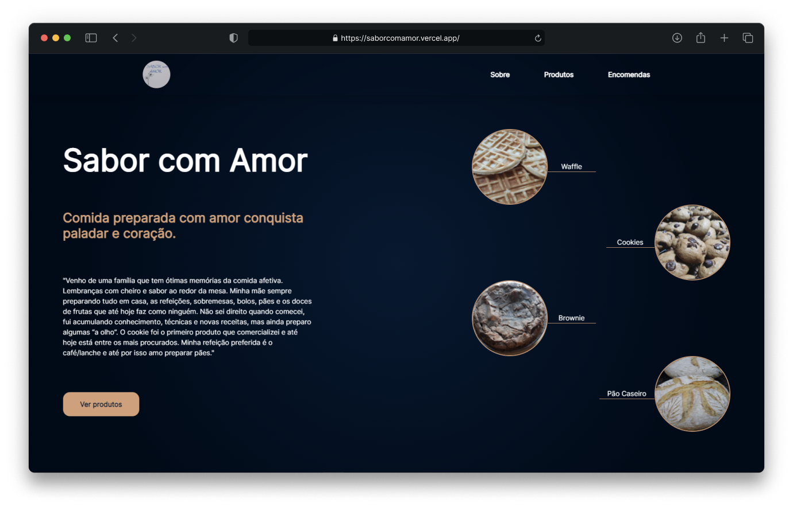

<h1 align="center"> Sabor com Amor </h1>

 

  

 

## 💻 Project

 ### What is the "Sabor com Amor"?
   A friend's mom sells artisan foods and wanted an easier way to share and showcase her work and products. So I decided
    to create a landing page that serves as a menu and presentation of how her "shop" works.

 

## 🚀 Installation
To run this application locally, follow these steps:

- Clone the repository to your local machine.
- Install the required dependencies by running `npm install` in the project directory.
- Start the server by running `npm run dev`.
- Open your web browser and navigate to http://localhost:3000.

 

## ☄️ Features

### About page
 - The About page provides information about a friend's mom who sells artisan food. Telling a little about her history and how she started to make these food

### Products Session
 - The Products section displays the different types of artisan food that are available for purchase.

### Ordering Section
 - The ordering part provides a button to get in touch and place the order

 

## 💻 Technologies

- Next.js
- Typescript
- Tailwind
- Framer Motion

 

## 🔖 Website
If you are interested, check out the project by clicking on the link below

- [Sabor com Amor](https://saborcomamor.vercel.app/)

